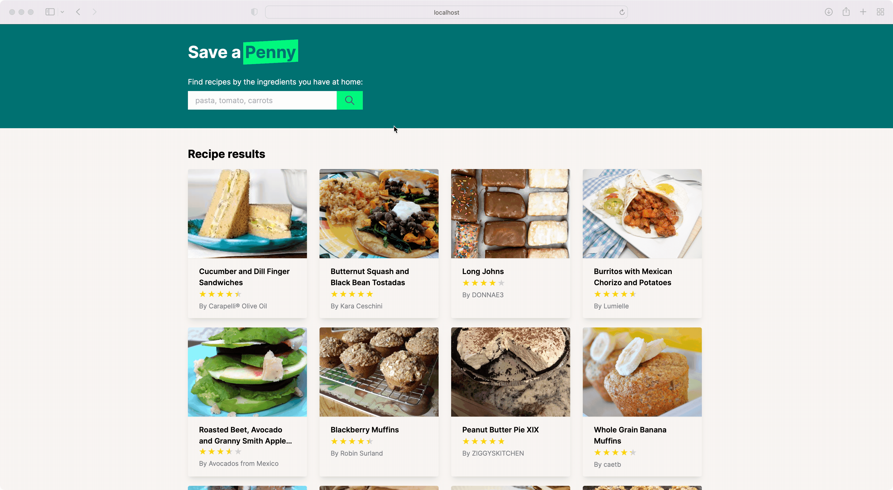

# recipes

Save a penny and find recipes with ingredients you already have at home 🥘.



## Links:

- Website: <https://savepenny.herokuapp.com/>

## Prerequisites

- Git
- Ruby 3.1
- Postgres 13
- Heroku CLI

## Setup

##### 1. Check out the repository

```
$ git clone git@github.com:frodsan/recipes.git
```

##### 2. Run setup script

Run the following commands to install dependencies and setup the database.

```
$ bin/setup
```

##### 3. Start the development server

You can start the server using the command given below.

```
$ bin/dev
```

And now you can visit the site with the URL http://localhost:3000.

## Description

The application help users to find recipes by the ingredients they have.


#### Data Seeds

The dataset can be found in [db/seeds/recipes-en.json](db/seeds/recipes-en.json)
and it has been populated into the database by `rails db:seed`. You can find the
code here: [db/seeds.rb](db/seeds.rb).

#### Database Structure

The format of the JSON objects found in the dataset is:

```json
{
  "title": "Golden Sweet Cornbread",
  "cook_time": 25,
  "prep_time": 10,
  "ingredients": [
    "1 cup all-purpose flour",
    "1 cup yellow cornmeal",
    "⅔ cup white sugar",
    "1 teaspoon salt",
    "3 ½ teaspoons baking powder",
    "1 egg",
    "1 cup milk",
    "⅓ cup vegetable oil"
  ],
  "ratings": 4.74,
  "cuisine": "",
  "category": "Cornbread",
  "author": "bluegirl",
  "image": "https://images.url/image.jpg"
}
```

I've created the `recipes` table with the same structure as the JSON object for simplicity.
I've decided to use `jsonb` as the type for the `ingredients` field, so it's straightforward
to read it from Rails, but also, there is no need to do any data transformation since I planned
to use [Postgres' search features][pgsearch].

#### Searching recipes by ingredients

Since the ingredients field uses `jsonb`, it is possible to parse
each string in the JSON array into a `tsvector`, a sorted list of
normalized lexemes:

```sql
# select to_tsvector('english', '[
#     "1 cup all-purpose flour",
#     "1 cup yellow cornmeal"
# ]') as ts_vector;
                                  ts_vector
--------------------------------------------------------------------------------
 '1':1,7 'all-purpos':3 'cornmeal':10 'cup':2,8 'flour':6 'purpos':5 'yellow':9
```

Then, I decided to use the `websearch_to_tsquery` function, which provides
search capabilities sort of like the ones used by search engines:

```sql
# -- Search by cornmeal and flour
# select to_tsvector('english', '[
#   "1 cup all-purpose flour",
#   "1 cup yellow cornmeal"
# ]') @@ websearch_to_tsquery('cornmeal flour') as must_be_true;
 must_be_true
--------------
 t

# -- Search by cornmeal but not flour
# select to_tsvector('english', '[
#   "1 cup all-purpose flour",
#   "1 cup yellow cornmeal"
# ]') @@ websearch_to_tsquery('cornmeal -flour') as must_be_false;
 must_be_false
--------------
 f
```

This is how is implemented in the model:

```ruby
class Recipe < ApplicationRecord
  scope :by_ingredients, -> (query) {
    where("to_tsvector('english', ingredients) @@ websearch_to_tsquery(?)", query)
  }
end
```

Also, I've created an index on the function result to speed up the queries:

```ruby
add_index :recipes, "to_tsvector('english', ingredients)", using: :gin
```

Explaining the query shows that the query uses the index:

```
> Recipe.by_ingredients('pasta, eggplant').explain
EXPLAIN for: SELECT "recipes".* FROM "recipes" WHERE (to_tsvector('english', ingredients) @@ websearch_to_tsquery('pasta, eggplant'))
                                                    QUERY PLAN
------------------------------------------------------------------------------------------------------------------
 Index Scan using index_recipes_on_to_tsvector_english_ingredients on recipes  (cost=0.11..6.11 rows=2 width=525)
   Index Cond: (to_tsvector('english'::regconfig, ingredients) @@ websearch_to_tsquery('pasta, eggplant'::text))
(2 rows)
```

#### Putting everything together

The rest is standard Rails code which can be found here:

- [app/models/recipe.rb](app/models/recipe.rb)
- [app/controllers/recipes_controller.rb](app/controllers/recipes_controller.rb)
- [app/views/recipes/](app/views/recipes/)

[pgsearch]: https://www.postgresql.org/docs/current/textsearch.html
